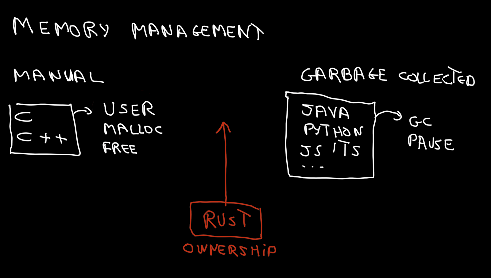

# Notes

1- Xavier slides about dojo rules

- https://docs.google.com/presentation/d/1G2OcmiEpYlmeX0Hn_Eyr9Npxda6v2T-19XFJ1X8uE0w/edit?usp=sharing

2- Rust language reputation and why people fails at Rust

- One reason memory management

- Attempt to emulate the methods of other languages without consulting the instructions.
- Attempt to grasp all concepts simultaneously and become overwhelmed by their abundance.

3- Code examples in 5 lines

- https://play.rust-lang.org/?version=stable&mode=debug&edition=2021&gist=5cb8f2182e1fe65d2d2c7879b2f00507

4- My problem, find the balance between practice and concepts

